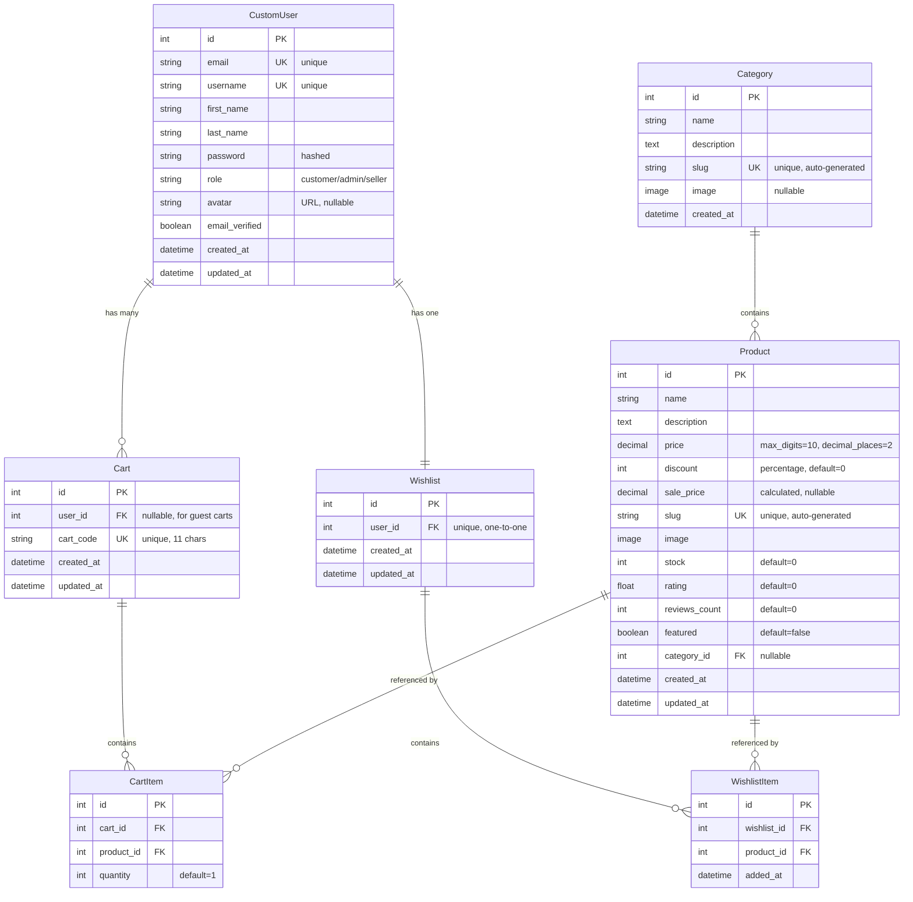

# E-Mart Database - Entity Relationship Diagram (ERD)

## Visual ERD



---

## Detailed Entity Specifications

### 1. CustomUser
**Purpose**: Stores user account information with role-based access

| Attribute | Type | Constraints | Description |
|-----------|------|-------------|-------------|
| id | Integer | PK, Auto-increment | Primary key |
| email | String(100) | Unique, Not Null | User email (also used for login) |
| username | String(150) | Unique, Not Null | Auto-generated from email |
| first_name | String(100) | Not Null | User's first name |
| last_name | String(100) | Not Null | User's last name |
| password | String(128) | Not Null | Hashed password (Django auth) |
| role | String(50) | Default='customer' | Choices: customer, admin, seller |
| avatar | URL | Nullable | Profile picture URL |
| email_verified | Boolean | Default=False | Email verification status |
| created_at | DateTime | Auto-now-add | Account creation timestamp |
| updated_at | DateTime | Auto-now | Last update timestamp |

**Indexes**:
- `email` (for fast login lookups)
- `role` (for role-based queries)

**Relationships**:
- One-to-Many with `Cart` (user can have multiple carts)
- One-to-One with `Wishlist` (user has one wishlist)

---

### 2. Category
**Purpose**: Product categorization for organization and filtering

| Attribute | Type | Constraints | Description |
|-----------|------|-------------|-------------|
| id | Integer | PK, Auto-increment | Primary key |
| name | String(100) | Not Null | Category name |
| description | Text | Not Null | Category description |
| slug | String(50) | Unique, Auto-generated | URL-friendly identifier |
| image | ImageField | Nullable | Category thumbnail |
| created_at | DateTime | Auto-now-add | Creation timestamp |

**Slug Generation**:
- Auto-generated from `name` using `slugify()`
- Ensures uniqueness with counter suffix if needed

**Relationships**:
- One-to-Many with `Product` (category contains many products)

---

### 3. Product
**Purpose**: Core product information with pricing and inventory

| Attribute | Type | Constraints | Description |
|-----------|------|-------------|-------------|
| id | Integer | PK, Auto-increment | Primary key |
| name | String(100) | Not Null | Product name |
| description | Text | Not Null | Product description |
| price | Decimal(10,2) | Not Null | Original price |
| discount | Integer | Default=0 | Discount percentage (0-100) |
| sale_price | Decimal(10,2) | Calculated, Nullable | Price after discount |
| slug | String(50) | Unique, Auto-generated | URL-friendly identifier |
| image | ImageField | Not Null | Product image (Cloudinary) |
| stock | Integer | Default=0 | Available quantity |
| rating | Float | Default=0 | Average rating (0-5) |
| reviews_count | Integer | Default=0 | Number of reviews |
| featured | Boolean | Default=False | Featured product flag |
| category_id | Integer | FK, Nullable | Reference to Category |
| created_at | DateTime | Auto-now-add | Creation timestamp |
| updated_at | DateTime | Auto-now | Last update timestamp |

**Calculated Fields**:
- `sale_price` = `price` - (`price` × `discount` / 100)
- Automatically calculated on save

**Indexes**:
- `category_id` (for category filtering)
- `slug` (for URL lookups)

**Relationships**:
- Many-to-One with `Category` (product belongs to one category)
- One-to-Many with `CartItem` (product can be in many carts)
- One-to-Many with `WishlistItem` (product can be in many wishlists)

---

### 4. Cart
**Purpose**: Shopping cart for both guest and authenticated users

| Attribute | Type | Constraints | Description |
|-----------|------|-------------|-------------|
| id | Integer | PK, Auto-increment | Primary key |
| user_id | Integer | FK, Nullable | Reference to CustomUser (null for guests) |
| cart_code | String(11) | Unique, Not Null | Unique cart identifier |
| created_at | DateTime | Auto-now-add | Cart creation timestamp |
| updated_at | DateTime | Auto-now | Last update timestamp |

**Cart Code**:
- 11-character random string
- Used for guest cart identification
- Persists in localStorage on frontend

**User Linking**:
- `user_id` is `NULL` for guest carts
- Automatically linked when user logs in
- Enables cart persistence across devices

**Relationships**:
- Many-to-One with `CustomUser` (cart belongs to user, nullable)
- One-to-Many with `CartItem` (cart contains many items)

---

### 5. CartItem
**Purpose**: Individual products in a cart with quantities

| Attribute | Type | Constraints | Description |
|-----------|------|-------------|-------------|
| id | Integer | PK, Auto-increment | Primary key |
| cart_id | Integer | FK, Not Null | Reference to Cart |
| product_id | Integer | FK, Not Null | Reference to Product |
| quantity | Integer | Default=1 | Item quantity |

**Calculated Fields** (via serializer):
- `sub_total` = `product.sale_price` × `quantity`

**Cascade Behavior**:
- Deletes when parent `Cart` is deleted
- Does NOT delete when `Product` is deleted (maintains referential integrity)

**Relationships**:
- Many-to-One with `Cart` (item belongs to one cart)
- Many-to-One with `Product` (item references one product)

---

### 6. Wishlist
**Purpose**: User's saved products for future purchase

| Attribute | Type | Constraints | Description |
|-----------|------|-------------|-------------|
| id | Integer | PK, Auto-increment | Primary key |
| user_id | Integer | FK, Unique, Not Null | Reference to CustomUser (one-to-one) |
| created_at | DateTime | Auto-now-add | Wishlist creation timestamp |
| updated_at | DateTime | Auto-now | Last update timestamp |

**Key Constraints**:
- One-to-One relationship with `CustomUser`
- Each user can have only ONE wishlist
- Auto-created when user adds first item

**Relationships**:
- One-to-One with `CustomUser` (user has one wishlist)
- One-to-Many with `WishlistItem` (wishlist contains many items)

---

### 7. WishlistItem
**Purpose**: Individual products in a user's wishlist

| Attribute | Type | Constraints | Description |
|-----------|------|-------------|-------------|
| id | Integer | PK, Auto-increment | Primary key |
| wishlist_id | Integer | FK, Not Null | Reference to Wishlist |
| product_id | Integer | FK, Not Null | Reference to Product |
| added_at | DateTime | Auto-now-add | When item was added |

**Unique Constraint**:
- `unique_together = ('wishlist', 'product')`
- Prevents duplicate products in same wishlist

**Cascade Behavior**:
- Deletes when parent `Wishlist` is deleted
- Does NOT delete when `Product` is deleted

**Relationships**:
- Many-to-One with `Wishlist` (item belongs to one wishlist)
- Many-to-One with `Product` (item references one product)

---

## Relationship Summary

### One-to-Many Relationships
1. **CustomUser → Cart**
   - One user can have multiple carts (historical carts)
   - `Cart.user_id` → `CustomUser.id`
   - Nullable (supports guest carts)

2. **Category → Product**
   - One category contains many products
   - `Product.category_id` → `Category.id`
   - Nullable (uncategorized products)

3. **Cart → CartItem**
   - One cart contains many items
   - `CartItem.cart_id` → `Cart.id`
   - Cascade delete

4. **Product → CartItem**
   - One product can be in many carts
   - `CartItem.product_id` → `Product.id`

5. **Wishlist → WishlistItem**
   - One wishlist contains many items
   - `WishlistItem.wishlist_id` → `Wishlist.id`
   - Cascade delete

6. **Product → WishlistItem**
   - One product can be in many wishlists
   - `WishlistItem.product_id` → `Product.id`

### One-to-One Relationships
1. **CustomUser ↔ Wishlist**
   - Each user has exactly one wishlist
   - `Wishlist.user_id` → `CustomUser.id`
   - Unique constraint

---

## Database Indexes

### Automatic Indexes (Primary Keys)
- All `id` fields are automatically indexed

### Custom Indexes
1. **CustomUser**:
   - `email` (for login queries)
   - `role` (for role-based filtering)

2. **Product**:
   - `category_id` (for category filtering)
   - `slug` (for URL lookups)

3. **Unique Constraints** (also create indexes):
   - `CustomUser.email`
   - `CustomUser.username`
   - `Category.slug`
   - `Product.slug`
   - `Cart.cart_code`
   - `Wishlist.user_id`
   - `WishlistItem(wishlist_id, product_id)` (composite)

---

## Key Design Decisions

### 1. Guest Cart Support
- `Cart.user_id` is nullable
- Allows guest users to shop without registration
- Cart automatically links to user upon login via `cart_code`

### 2. Slug-based URLs
- `Category.slug` and `Product.slug` for SEO-friendly URLs
- Auto-generated from name with uniqueness guarantee
- Example: `/products/gaming-laptop/` instead of `/products/123/`

### 3. Calculated Sale Price
- `Product.sale_price` calculated on save
- Ensures consistency between price, discount, and sale_price
- Reduces calculation overhead on queries

### 4. One-to-One Wishlist
- Each user has exactly one wishlist
- Simplifies wishlist management
- Auto-created on first item addition

### 5. Soft Relationships
- Products are not deleted when referenced by CartItem/WishlistItem
- Maintains data integrity for historical records
- Consider soft-delete pattern for products in production

---

## Sample Queries

### Get User's Cart with Items
```sql
SELECT c.*, ci.*, p.*
FROM api_cart c
LEFT JOIN api_cartitem ci ON c.id = ci.cart_id
LEFT JOIN api_product p ON ci.product_id = p.id
WHERE c.user_id = 1;
```

### Get Products by Category
```sql
SELECT p.*
FROM api_product p
INNER JOIN api_category cat ON p.category_id = cat.id
WHERE cat.slug = 'electronics';
```

### Get User's Wishlist
```sql
SELECT w.*, wi.*, p.*
FROM api_wishlist w
LEFT JOIN api_wishlistitem wi ON w.id = wi.wishlist_id
LEFT JOIN api_product p ON wi.product_id = p.id
WHERE w.user_id = 1;
```

---

## Database Normalization

**Current Normalization Level**: **3NF (Third Normal Form)**

✅ **1NF**: All attributes contain atomic values
✅ **2NF**: No partial dependencies (all non-key attributes depend on entire primary key)
✅ **3NF**: No transitive dependencies (no non-key attribute depends on another non-key attribute)

**Exception**: `Product.sale_price` is denormalized for performance (calculated from `price` and `discount`)
