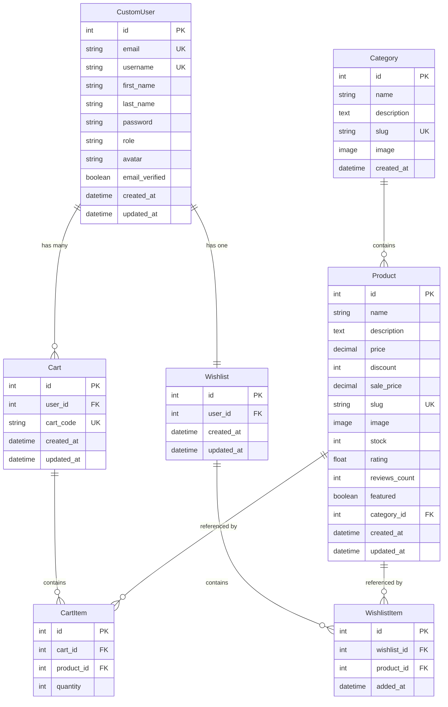

# E-Mart - Complete Project Documentation

> **A Modern Full-Stack E-Commerce Platform**  
> Built with Next.js, Django REST Framework, and PostgreSQL

---

## Table of Contents

1. [Project Overview](#project-overview)
2. [Technology Stack](#technology-stack)
3. [System Architecture](#system-architecture)
4. [Database Design](#database-design)
5. [API Documentation](#api-documentation)
6. [Features & Functionality](#features--functionality)
7. [Authentication & Security](#authentication--security)
8. [Deployment Guide](#deployment-guide)
9. [Development Workflow](#development-workflow)
10. [Best Practices Implemented](#best-practices-implemented)

---

## 1. Project Overview

### What is E-Mart?

E-Mart is a **production-ready e-commerce platform** that demonstrates modern web development practices. It's a complete online shopping solution where users can:

- Browse products by category
- Search and filter products
- Add items to cart and wishlist
- Create accounts and manage profiles
- Make purchases (cart functionality)

### Why This Project Matters

This project showcases:
- **Full-stack development** - Both frontend (what users see) and backend (server logic)
- **Industry best practices** - Code organization, security, performance
- **Real-world features** - Authentication, database persistence, API design
- **Production deployment** - Hosted on real servers (Render, Vercel)

---

## 2. Technology Stack

### Frontend (What Users See)

#### **Next.js 16.1.6**
- **What it is**: A React framework for building web applications
- **Why we use it**: 
  - Server-Side Rendering (SSR) for faster page loads
  - Built-in routing (no need for React Router)
  - Automatic code splitting for better performance
  - SEO-friendly (search engines can read the content)

#### **React**
- **What it is**: A JavaScript library for building user interfaces
- **Why we use it**: 
  - Component-based architecture (reusable UI pieces)
  - Virtual DOM for fast updates
  - Large ecosystem and community support

#### **TypeScript**
- **What it is**: JavaScript with type checking
- **Why we use it**: 
  - Catches errors before runtime
  - Better IDE autocomplete
  - Easier to maintain large codebases

#### **Tailwind CSS**
- **What it is**: A utility-first CSS framework
- **Why we use it**: 
  - Rapid UI development
  - Consistent design system
  - Small bundle size (only includes used styles)

#### **Zustand**
- **What it is**: A state management library
- **Why we use it**: 
  - Simpler than Redux
  - Built-in persistence (saves to localStorage)
  - TypeScript-friendly

### Backend (Server Logic)

#### **Django 5.1.5**
- **What it is**: A high-level Python web framework
- **Why we use it**: 
  - "Batteries included" - comes with authentication, admin panel, ORM
  - Secure by default (protects against common attacks)
  - Excellent documentation

#### **Django REST Framework (DRF)**
- **What it is**: A toolkit for building Web APIs
- **Why we use it**: 
  - Serialization (convert Python objects to JSON)
  - Authentication and permissions
  - Browsable API for testing

#### **PostgreSQL**
- **What it is**: A powerful relational database
- **Why we use it**: 
  - ACID compliance (data integrity)
  - Advanced features (JSON fields, full-text search)
  - Scalable for production

#### **JWT (JSON Web Tokens)**
- **What it is**: A standard for secure authentication
- **Why we use it**: 
  - Stateless (server doesn't need to store sessions)
  - Works across different domains
  - Secure and compact

### Infrastructure

#### **Cloudinary**
- **What it is**: Cloud-based image management
- **Why we use it**: 
  - Persistent image storage (Render's filesystem is ephemeral)
  - Automatic image optimization
  - CDN for fast delivery worldwide

#### **Render (Backend Hosting)**
- **What it is**: Cloud platform for hosting web services
- **Why we use it**: 
  - Free tier for PostgreSQL
  - Automatic deployments from Git
  - Built-in SSL certificates

#### **Vercel (Frontend Hosting)**
- **What it is**: Platform for frontend frameworks
- **Why we use it**: 
  - Optimized for Next.js
  - Global CDN
  - Instant deployments

---

## 3. System Architecture

### High-Level Overview

The E-Mart application follows a **client-server architecture** with clear separation between frontend and backend:

**Frontend (Client)**:
- Runs in user's browser
- Handles UI rendering and user interactions
- Makes HTTP requests to backend API
- Manages local state with Zustand

**Backend (Server)**:
- Runs on Render servers
- Processes business logic
- Manages database operations
- Returns JSON responses

**Database**:
- PostgreSQL hosted on Render
- Stores all persistent data
- Accessed only by backend (security)

### Request Flow Example

**Scenario**: User adds a product to cart

1. **User Action**: Clicks "Add to Cart" button
2. **Frontend**: Zustand updates local state (optimistic update for instant feedback)
3. **API Call**: Frontend sends POST request to `/api/cart/add/` with product data
4. **Authentication**: Django checks JWT token in request header
5. **Validation**: DRF serializer validates request data (product exists, quantity > 0)
6. **Database**: Django ORM saves cart item to PostgreSQL
7. **Response**: Server returns updated cart data as JSON
8. **State Sync**: Zustand updates state with server response
9. **UI Update**: React re-renders cart icon with new item count

---

## 4. Database Design

### Entity Relationship Diagram (ERD)

Our database has **7 main entities** (tables) with specific relationships:



### Key Design Decisions

#### 1. **Guest Cart Support**
- `Cart.user_id` is nullable
- Allows shopping without registration
- Cart identified by unique `cart_code` (stored in localStorage)
- Automatically links to user account upon login

#### 2. **Slug-based URLs**
- Both `Category` and `Product` have slug fields
- Example: `/products/gaming-laptop/` instead of `/products/123/`
- **Benefits**: SEO-friendly, human-readable, shareable

#### 3. **Calculated Sale Price**
- `Product.sale_price` is calculated and stored
- Formula: `sale_price = price - (price × discount / 100)`
- **Why store it?**: Faster queries (no calculation needed)
- **Trade-off**: Slight data redundancy for performance gain

#### 4. **One-to-One Wishlist**
- Each user has exactly ONE wishlist
- Simplifies logic (no need to choose which wishlist)
- Auto-created when user adds first item

---

## 5. API Documentation

### Authentication Flow

**JWT (JSON Web Token)** is used for stateless authentication:

1. **Login**: User sends email + password
2. **Server**: Validates credentials, generates two tokens:
   - **Access Token**: Short-lived (15 min), used for API requests
   - **Refresh Token**: Long-lived (7 days), used to get new access token
3. **Storage**: Tokens stored in cookies (secure) and localStorage (fallback)
4. **Requests**: Access token sent in `Authorization` header
5. **Expiration**: When access token expires, use refresh token to get new one

### Key Endpoints

#### Authentication

**Sign Up**
```http
POST /api/auth/signup/
{
  "email": "user@example.com",
  "first_name": "John",
  "last_name": "Doe",
  "password": "SecurePass123",
  "password_confirm": "SecurePass123"
}
```

**Login**
```http
POST /api/auth/login/
{
  "email": "user@example.com",
  "password": "SecurePass123"
}
```

**Get Current User** (Protected)
```http
GET /api/auth/me/
Authorization: Bearer <access_token>
```

#### Products

**List Products with Filters**
```http
GET /api/products/?category=electronics&min_price=100&max_price=1000&search=laptop&ordering=-rating
```

**Query Parameters**:
- `category`: Filter by category slug
- `min_price` / `max_price`: Price range
- `search`: Search in name/description
- `ordering`: Sort (`-rating` = descending)

**Get Product Details**
```http
GET /api/products/gaming-laptop/
```

#### Cart

**Add to Cart**
```http
POST /api/cart/add/
{
  "cart_code": "abc123xyz",
  "product_id": 1,
  "quantity": 2
}
```

**Get Cart**
```http
GET /api/cart/get/?cart_code=abc123xyz
```

**Update Quantity**
```http
PATCH /api/cart/update/
{
  "cart_code": "abc123xyz",
  "product_id": 1,
  "quantity": 3
}
```

#### Wishlist (Requires Authentication)

**Get Wishlist**
```http
GET /api/wishlist/get/
Authorization: Bearer <access_token>
```

**Add to Wishlist**
```http
POST /api/wishlist/add/
Authorization: Bearer <access_token>
{
  "product_id": 2
}
```

---

## 6. Features & Functionality

### User Features

#### Product Browsing
- Grid layout with product cards
- Category filtering
- Search functionality
- Price range filtering
- Sort by price, rating, date
- Pagination (20 items per page)

#### Shopping Cart
- Add products with quantity
- Update quantities
- Remove items
- View cart total
- **Guest Support**: Cart persists in localStorage
- **Logged In**: Cart syncs across devices

#### Wishlist
- Save products for later
- Move items to cart
- Remove items
- **Requires Authentication**: Personal data tied to account

#### User Authentication
- Sign up with email/password
- Login with JWT tokens
- Logout (blacklist refresh token)
- Protected routes (account, wishlist)
- Profile management

---

## 7. Authentication & Security

### Security Best Practices

#### 1. **Password Hashing**
```python
# Django uses PBKDF2 algorithm
password = "user_password"
hashed = "pbkdf2_sha256$600000$salt$hash"
```

**Why PBKDF2?**
- Industry standard
- Computationally expensive (prevents brute force)
- Salted (prevents rainbow table attacks)

#### 2. **Secure Cookies**
```typescript
// Cookies set with security flags
Secure: true        // Only sent over HTTPS
SameSite: Lax       // Prevents CSRF attacks
HttpOnly: true      // Not accessible via JavaScript
```

#### 3. **CORS Protection**
```python
# Only allow requests from trusted origins
CORS_ALLOWED_ORIGINS = [
    "http://localhost:3000",
    "https://your-frontend.vercel.app",
]
```

#### 4. **Input Validation**
- **Frontend**: Basic validation (email format, required fields)
- **Backend**: Comprehensive validation (uniqueness, business rules)
- **Database**: Constraints (unique, not null, foreign keys)

---

## 8. Deployment Guide

### Backend (Render)

1. **Prepare Django**:
   - Set `DEBUG=False`
   - Configure `ALLOWED_HOSTS`
   - Set up Cloudinary for media files
   - Configure PostgreSQL with `dj-database-url`

2. **Create Render Web Service**:
   - Connect GitHub repository
   - Build Command: `pip install -r requirements.txt && python manage.py collectstatic --noinput && python manage.py migrate`
   - Start Command: `gunicorn emartApi.wsgi:application`

3. **Environment Variables**:
   - `DEBUG=False`
   - `SECRET_KEY=<random-secret>`
   - `DATABASE_URL=<postgres-url>`
   - `CLOUDINARY_CLOUD_NAME=<name>`
   - `CLOUDINARY_API_KEY=<key>`
   - `CLOUDINARY_API_SECRET=<secret>`

### Frontend (Vercel)

1. **Prepare Next.js**:
   - Set `NEXT_PUBLIC_API_URL` to production backend URL

2. **Deploy to Vercel**:
   - Import GitHub repository
   - Framework: Next.js
   - Root Directory: `frontend`
   - Add environment variable: `NEXT_PUBLIC_API_URL`

---

## 9. Development Workflow

### Local Setup

**Backend**:
```bash
cd backend
python -m venv venv
source venv/bin/activate
pip install -r requirements.txt
python manage.py migrate
python manage.py runserver
```

**Frontend**:
```bash
cd frontend
npm install
npm run dev
```

### Git Workflow

```bash
git checkout -b feature/new-feature
# Make changes
git add .
git commit -m "Add new feature"
git push origin feature/new-feature
# Create Pull Request
```

---

## 10. Best Practices Implemented

### Code Organization
- **Backend**: Models → Serializers → Views → URLs (separation of concerns)
- **Frontend**: Components → Pages → Store → API (modular architecture)

### Performance
- Database indexing on frequently queried fields
- Image optimization with Cloudinary
- Code splitting with Next.js
- Pagination for large datasets

### Security
- Environment variables for secrets
- SQL injection prevention (Django ORM)
- XSS prevention (React auto-escaping)
- CSRF protection (JWT tokens)

### API Design
- RESTful URLs
- Proper HTTP status codes
- Consistent response format
- API documentation (Swagger)

---

## Conclusion

E-Mart demonstrates **production-ready full-stack development** with:

✅ Modern technology stack  
✅ RESTful API design  
✅ Secure authentication  
✅ Database persistence  
✅ Cloud deployment  
✅ Industry best practices  

This project serves as a comprehensive portfolio piece showcasing professional web development skills.

---

**For detailed documentation, see**:
- [API Demo Script](./api_demo_script.md)
- [Database ERD](./database_erd.md)
- [Deployment Config](./deployment_config.md)
- [Postman Collection](./emart_api_postman_collection.json)
